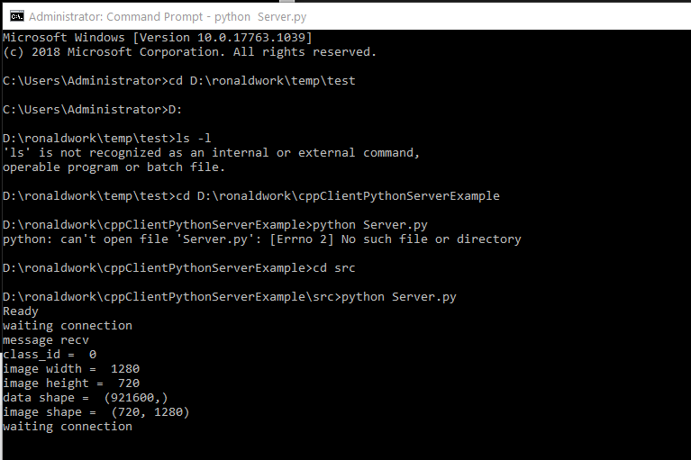

This project demonstrate how to setup a python Server and C++ client with the message of an image and some parameters.\
The aim of this project is to provide a method for a deep learning python server and a c++ call client.

Library required:
python3
opencv3.4
zeromq
protobuf

All of the source code can be found in ./src

User Guide:

1. Prepare all the library both in python environment and c++ environment.

2. Use protoc to make the C++ header, cpp and .py
    protoc --cpp_out=. my_message.proto\
    protoc --python_out=. my_message.proto
    
    
3. You can test python server and python client using Client.py and Server.py found in ./src.
You should be able to see
 
 

4. Build your c++ project with the c++header and cpp formed by protoc. 